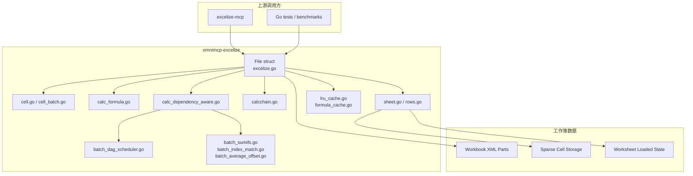
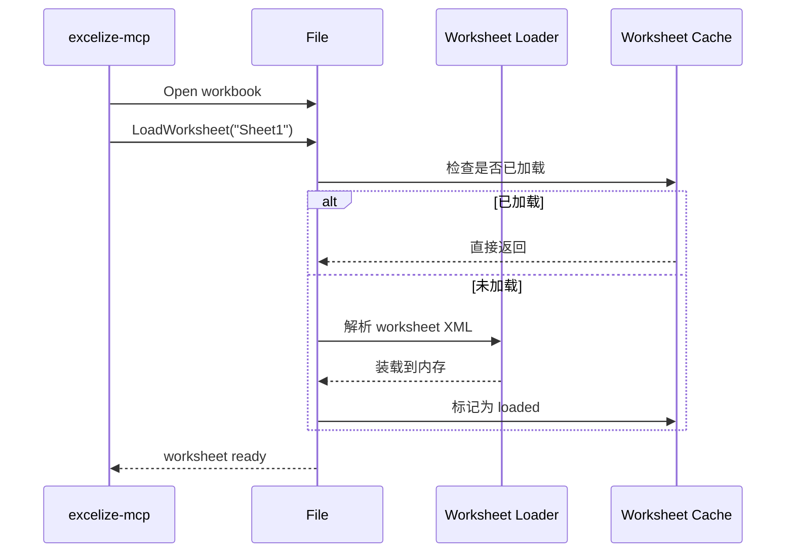
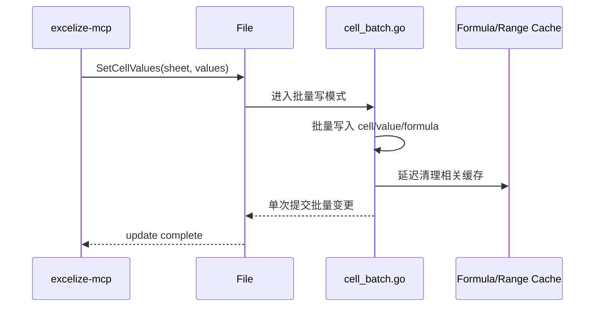
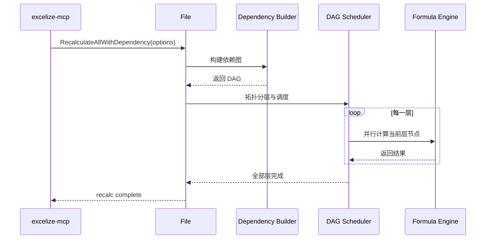
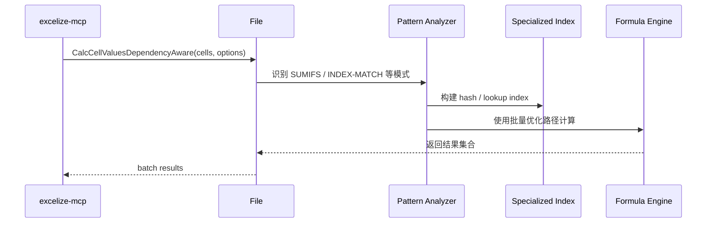

# MaybeAI OmniMCP Excelize Runtime

## 1. 文档范围

这份文档对应本地路径：

- `mcp/omnimcp-excelize`

但它实际对应的上游仓库是：

- `OmniMCP-AI/excelize`

也就是说，它不是一个 HTTP 服务，也不是一个 MCP Server，而是一个 **高性能 Excel 引擎库**。

在 MaybeAI 体系里，它的主要角色是：

1. 作为 `excelize-mcp` 的底层工作簿引擎
2. 提供高性能公式计算、批量更新和依赖感知重算能力
3. 承接 `native =SQL()`、批量公式、DAG 重算、worksheet 缓存等底层实现

因此，这份文档的重点不是 REST 接口，而是：

- 库级架构
- 运行时数据流
- 关键公开 API
- 与 `excelize-mcp` 的集成方式

---

## 2. 模块定位

`omnimcp-excelize` 本质上是 `xuri/excelize` 的高性能 fork。

相对标准版，它增加或强化了这些能力：

1. DAG 依赖感知重算
2. 批量公式计算优化
3. SUMIFS / INDEX-MATCH / OFFSET 等模式优化
4. 多级缓存与 LRU 内存控制
5. Worksheet 显式加载与内存保留策略
6. 面向超大表格场景的并发和批量 API

从 MaybeAI 的整体链路看，它位于最底层：

```text
apps/chat
  -> fastestai-playground
  -> excelize-mcp
  -> omnimcp-excelize
```

也就是：

- `apps/chat` 发起表格操作
- `fastestai-playground` 做鉴权与代理
- `excelize-mcp` 封装 MCP / REST 能力
- `omnimcp-excelize` 真正执行工作簿读写与公式计算

---

## 3. 总体架构图



---

## 4. 运行时核心组件

### 4.1 `excelize.go`

这里定义核心 `File` 结构，是整个引擎运行时的入口。

它负责管理：

- 工作簿状态
- worksheet 缓存
- 公式与范围缓存
- 并发控制
- 重算锁
- 全局 options

文档和代码里可见的一个重要 option 是：

- `KeepWorksheetInMemory`

它用于控制 worksheet 是否持续留在内存中，以减少重复加载成本。

### 4.2 单元格与批量写入

核心文件：

- `cell.go`
- `cell_batch.go`

这里提供两类能力：

1. 普通单元格读写
2. 批量 cell/value/formula 更新

其中批量 API 的意义非常大，因为它决定了在大表场景下，`excelize-mcp` 是否能避免逐格更新造成的极端性能问题。

### 4.3 公式计算引擎

核心文件：

- `calc_formula.go`
- `calc.go`
- `calc_optimized.go`
- `calc_subexpr.go`

它负责：

- 公式解析与求值
- 公式函数实现
- 子表达式缓存
- 并发优化版本的计算

当前仓库说明里强调支持 100+ Excel 函数，并且针对批量场景进行了专项优化。

### 4.4 依赖感知重算引擎

核心文件：

- `calc_dependency_aware.go`
- `batch_dependency.go`
- `batch_dag.go`
- `batch_dag_scheduler.go`

这是这个 fork 最重要的差异化能力之一。

核心思想是：

1. 从公式中抽取依赖关系
2. 构建有向无环图（DAG）
3. 做拓扑分层
4. 只重算受影响的节点
5. 对可并行层使用 worker pool 并发执行

这比传统按 `calcChain` 线性推进的策略更适合超大表和高相似公式场景。

### 4.5 批量优化模块

核心文件：

- `batch_sumifs.go`
- `batch_index_match.go`
- `batch_average_offset.go`
- `batch_sumproduct.go`

这些模块的核心目标不是“支持某个函数”，而是识别大批量相似公式模式并做向量化/索引化处理。

典型策略包括：

- 对重复 `SUMIFS` 模式建立 criteria 索引
- 对 `INDEX/MATCH` 建 hash index
- 对偏移类或重复扫描类公式做批量合并

这也是 README 里提到 10x 到 100x 加速的主要来源。

### 4.6 Worksheet 管理

核心文件：

- `sheet.go`
- `rows.go`
- `excelize.go`

这里有一个非常关键的能力：

- `LoadWorksheet(sheet)`
- `IsWorksheetLoaded(sheet)`

也就是说，这个 fork 不只是“打开工作簿”，还显式区分：

1. 文件结构已打开
2. 某个 worksheet 是否已经实际装载进内存

这对 `excelize-mcp` 非常重要，因为它在文件缓存之上还会再做 worksheet 级缓存跟踪。

### 4.7 多级缓存

关键文件：

- `lru_cache.go`
- `formula_cache.go`

从现有文档可见，缓存至少覆盖这些层级：

- 公式结果缓存
- range matrix 缓存
- MATCH / INDEX 索引缓存
- IFS criteria 匹配缓存
- 样式缓存
- shared formula 缓存

目标是：

1. 降低重复计算
2. 限制内存膨胀
3. 把超大工作簿从“不可用”变成“可用”

---

## 5. 核心运行时流程

### 5.1 打开文件与加载 worksheet



### 5.2 批量写入流程



这个流程的关键点是：

- 不在每次单元格更新后立即全量清缓存
- 而是在批量完成后统一做必要的缓存失效

### 5.3 依赖感知重算流程



### 5.4 批量公式优化流程



---

## 6. 关键公开 API

由于它是库而不是服务，这里的“接口说明”应理解为 **Go API**。

### 6.1 Worksheet 生命周期

- `LoadWorksheet(sheet string)`
- `IsWorksheetLoaded(sheet string)`

用途：

- 显式控制 worksheet 何时加载
- 配合上层服务进行 worksheet 内存管理

### 6.2 批量写入

- `SetCellValues(sheet string, values map[string]interface{})`

用途：

- 高效率批量写值 / 写公式
- 减少逐格写入带来的锁、缓存与性能损耗

### 6.3 批量计算

- `CalcCellValues(sheet string, cells []string)`
- `CalcCellValuesDependencyAware(sheet string, cells []string, options ...)`

用途：

- 一次性计算多个单元格公式
- 在 dependency-aware 模式下利用 DAG 与批量优化路径

### 6.4 全量重算

- `RecalculateAllWithDependency(options)`

用途：

- 对大工作簿执行依赖感知重算
- 替代简单线性 calcChain 重算策略

### 6.5 与 calcChain 相关能力

- `calcchain.go` 维护 Excel 原生 `calcChain.xml`

但从当前仓库说明看，真正的大规模高性能路径已经转向：

- DAG dependency-aware recalculation

而不是单纯依赖 Excel 传统 calcChain。

### 6.6 自定义函数与 AI 占位能力

从 `ai_formula.go` 可见，目前存在：

- `AI(param1, param2)`

当前实现更偏占位/兼容逻辑：

- 返回当前单元格缓存值

注释里可以看到未来可扩展成调用 FastestAI / MCP 工具的公式函数，但当前默认实现并不是完整远程调用引擎。

---

## 7. 与 `excelize-mcp` 的关系

### 7.1 分层关系

两者关系可以理解为：

```text
omnimcp-excelize = 计算与工作簿引擎
excelize-mcp     = 面向 REST / MCP 的服务封装层
```

`excelize-mcp` 主要负责：

- HTTP / MCP 对外暴露
- 文档 ID / GridFS / 版本 / 用户上下文管理
- 把外部请求转换为工作簿操作

`omnimcp-excelize` 主要负责：

- 打开、加载和修改 workbook
- 公式解析与计算
- 批量优化
- 依赖图构建与重算
- 内存与缓存控制

### 7.2 为什么它对 MaybeAI 很关键

如果没有这一层，`excelize-mcp` 只能依赖标准 Excelize 的基础能力；在这些场景下就会很吃力：

- 超大公式表
- 大量相似业务公式
- 频繁 update + recalc
- 原生 `=SQL()` / 复杂工作表联动
- 工作流驱动下的连续重算

也正因为如此，`DEBUG_LOCAL_EXCELIZE.md` 才会把这个仓库视为 SQL 公式迁移与重算行为验证的核心依赖。

---

## 8. 本地开发与排查

### 8.1 常用命令

根据仓库现有说明，可用：

```bash
go build -v .
go test -v -timeout 60m -race ./... -coverprofile='coverage.txt' -covermode=atomic
go test -bench=. -benchmem ./...
go vet ./...
```

### 8.2 性能与重算排查重点

如果排查公式/重算问题，优先看：

1. 是否命中了批量 API，而不是逐格 API
2. 是否走了 dependency-aware 路径
3. worksheet 是否重复加载
4. range / formula cache 是否异常膨胀
5. 是否存在可以专项优化的公式模式

### 8.3 推荐关注文件

- `README.md`
- `CLAUDE.md`
- `excelize.go`
- `cell_batch.go`
- `calc_formula.go`
- `calc_dependency_aware.go`
- `batch_dependency.go`
- `batch_dag_scheduler.go`
- `batch_sumifs.go`
- `batch_index_match.go`
- `calcchain.go`
- `lru_cache.go`

### 8.4 相关补充文档

- `DAG_VS_CALCCHAIN_COMPARISON.md`
- `OPTIMIZATION_REPORT.md`
- `PERF.md`

---

## 9. 在 MaybeAI 文档体系中的位置

如果把这次整理的几份文档串起来，顺序应该是：

1. `app-factory/runtime.md`：前端 Spreadsheet 入口
2. `fastestai-playground/runtime.md`：业务代理与鉴权层
3. `mcp/excelize-mcp/runtime.md`：REST / MCP 服务层
4. `mcp/omnimcp-excelize/runtime.md`：底层 Excel 计算引擎层

也就是这条完整链路：

```text
apps/chat
  -> fastestai-playground
  -> excelize-mcp
  -> omnimcp-excelize
```

