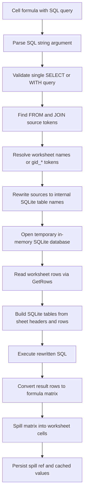
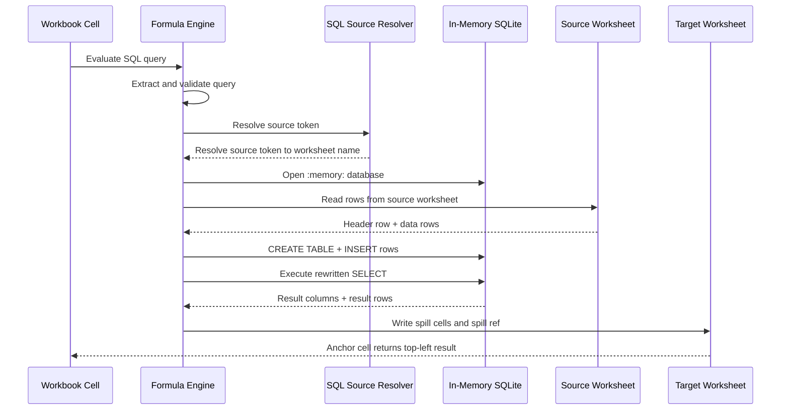
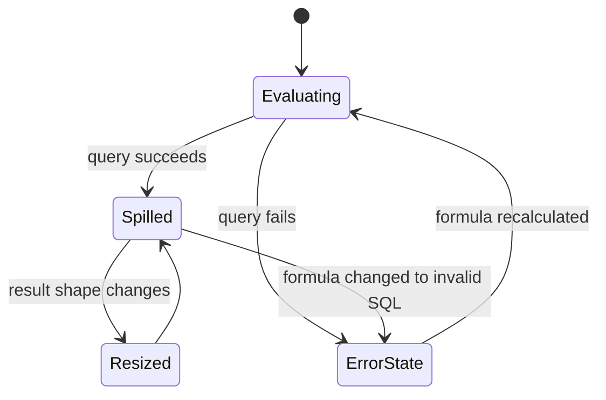

# SQL Formula Architecture

This document explains how the native `SQL("...")` formula works in `omnimcp-excelize`, where the SQLite data is stored, why this feature exists, and the main tradeoffs.

## Overview

The SQL formula is a custom workbook-aware formula function. It lets a sheet cell run a read-only SQL query against worksheet data and return the result as a spill matrix.

Example:

```excel
=SQL("select ""Category"", sum(""Amount"") as ""Total"" from ""Data"" group by ""Category"" order by ""Category""")
```

The first row of the query result becomes the output header row. The full result spills from the anchor cell into the worksheet.

## Primary Purpose

The feature exists to solve a gap between spreadsheet formulas and relational data processing.

Use it when you want to:

- aggregate worksheet rows with `GROUP BY`
- filter and reshape data with `WHERE`, `CASE`, `CAST`, and `ORDER BY`
- express report logic more clearly than nested Excel formulas
- generate report tables from one anchor formula cell
- keep the logic inside the workbook formula engine instead of exporting to an external SQL step

In practice, it acts like an embedded analytical query layer over workbook sheets.

## How It Works

At a high level:

1. The formula engine recognizes `SQL(...)`.
2. The SQL text is extracted and validated.
3. Worksheet names or custom tokens such as `gid_7` are resolved.
4. Referenced worksheets are copied into temporary SQLite tables.
5. SQLite executes the query.
6. The result is converted to a matrix and spilled back into the worksheet.
7. The spilled cells and spill range metadata are persisted so the workbook can be saved and reopened with the computed result intact.

### Execution Flow



### Sequence Diagram



## Storage Model

There are two different storage layers involved.

### 1. SQLite Storage

The SQLite database is temporary and in-memory only.

- It is opened with `sql.Open("sqlite", ":memory:")`.
- A fresh database is built during evaluation.
- Referenced worksheet data is materialized into temporary SQLite tables.
- The database is closed after compilation or execution finishes.

This means there is no persistent `.sqlite` file on disk for the SQL formula engine itself.

### 2. Workbook Storage

The query result is persisted into normal worksheet cells after evaluation.

- the anchor formula cell keeps the formula text
- the anchor cell stores the spill reference such as `A1:B3`
- spilled cells receive cached values
- stale spill cells are cleared if the result shrinks or the query becomes invalid

That persisted spill output is what survives `SaveAs(...)` and `OpenFile(...)`.

## Data Mapping Rules

When a worksheet is copied into SQLite:

- row 1 becomes the SQL column header row
- blank headers are replaced with generated names such as `_col_A`
- duplicate headers are made unique, for example `Amount__2`
- empty cells become `nil` or empty string depending on the row value
- text values are heuristically coerced into booleans, integers, or floats when possible

This gives SQL a table-like view of a worksheet without changing the original sheet data model.

## Source Resolution

By default, source tokens in `FROM` or `JOIN` are treated as worksheet names.

Example:

```sql
select * from "Data"
```

The engine also supports custom source resolution through `SetSQLSourceResolver(...)`. This is used for non-standard identifiers such as `gid_7`.

Example mapping:

- `gid_7` -> `Sales`
- `gid_0` -> `Traffic`

That allows upstream systems to expose stable logical identifiers without forcing worksheet names to appear directly in formulas.

## Dependency Behavior

SQL formulas integrate with the workbook dependency system, but the dependency granularity is coarse.

The engine marks a SQL formula as dependent on whole source sheets, not exact referenced cells.

That means:

- any relevant change in a source sheet can trigger recalculation
- dependency tracking is simpler and safer
- recalculation scope may be larger than strictly necessary

This is a deliberate tradeoff because parsing arbitrary SQL into exact cell-level dependencies would be much more complex and error-prone.

## Why Use SQL Instead of Normal Excel Formulas

SQL is a good fit when the output is tabular and relational:

- summarizing rows by category
- filtering messy imported data
- building grouped report tables
- doing joins or derived-table logic
- cleaning text before aggregation

Normal Excel formulas are still a better fit when:

- the logic is cell-oriented rather than table-oriented
- the result is scalar and local
- users need Excel-native semantics and compatibility first
- the operation depends heavily on spreadsheet-specific functions

## Pros

- expressive for analytical and reporting workloads
- much easier to read than deeply nested lookup and aggregation formulas
- supports `WITH`, subqueries, `CASE`, `CAST`, and standard SQL grouping/filtering
- workbook-aware source resolution keeps the query inside the Excel engine
- returns a spill matrix naturally from one anchor formula
- persisted spill results survive save and reopen
- read-only restriction reduces risk from destructive queries

## Cons

- every evaluation rebuilds temporary SQLite tables from worksheet rows
- dependency tracking is sheet-level, not cell-level
- type coercion is heuristic and may not always match user expectations
- users need to know SQL syntax in addition to spreadsheet formulas
- exact quoted identifier matching can be strict for messy headers
- large sheets can make repeated SQL recalculation expensive

## Why SQLite Was Chosen

SQLite is used here as an embedded query engine, not as a durable database.

It is a practical choice because it provides:

- SQL parsing and execution without running an external service
- low integration overhead inside Go
- support for `SELECT`, `WITH`, grouping, sorting, casting, and expressions
- an in-memory mode that fits formula evaluation well

The design goal is not persistent storage. The goal is to get a compact embedded SQL runtime over workbook data.

## Error and Spill Management

SQL formulas have extra persistence logic because the result can span many cells.

The engine must:

- calculate the matrix result
- update the anchor formula spill reference
- write all spilled values
- clear old spill cells if the new result is smaller
- clear old spill cells if the query becomes invalid
- refresh worksheet dimensions after spill changes

This is why SQL formulas use a spill-aware persistence path instead of the normal scalar formula cache path.

### Spill Lifecycle



## Practical Summary

`SQL("...")` is best understood as:

- a native formula entry point
- backed by a temporary in-memory SQLite database
- sourcing data from workbook worksheets
- producing a persistent spill range in the workbook

That combination gives the project an embedded relational query capability without introducing an external database dependency into normal formula execution.

## Relevant Implementation Files

- `sql_formula.go`
- `calc.go`
- `batch_dag_scheduler.go`
- `excelize.go`
- `sql_formula_test.go`
- `calc_sql_formula_persist_test.go`
